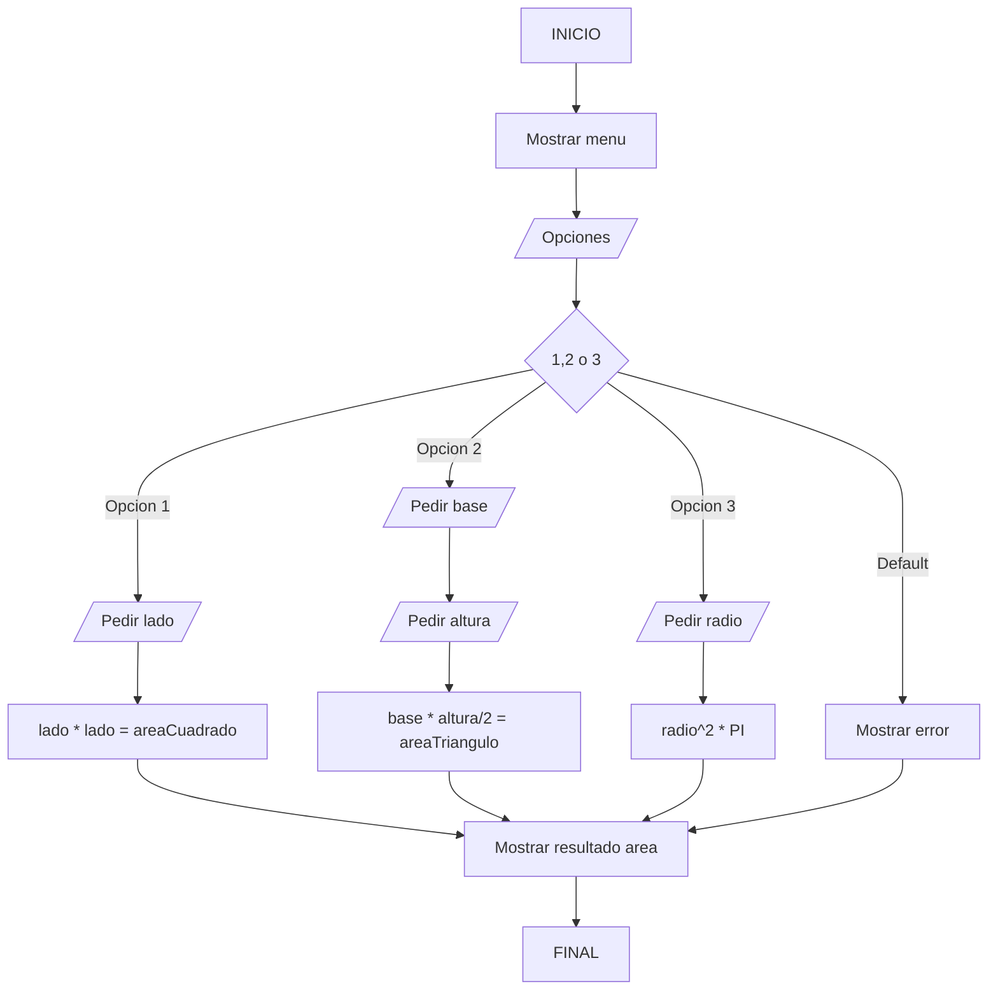

# examenDAM
# Estos son los pasos a realizar en el examen:
Para el primer ejercicio lo que tenemos que hacer es copiar el enlace del repositorio
que queremos clonar y una vez hecho esto vamos al terminal y usamos git clone con el enlace
para clonarlo.

Para el segundo ejercicio tenemos que ir a github, darle a crear repositorio y darle a privado, después de esto debemos
modificar el Readme que podemos hacerlo desde el propio IDE de Intellij y hacer un git add Readme.md para cuando lo 
subamos solo subir el Readme, hacemos un commit yendo a la terminal y haciendo git commit -m "comentario" para tener 
nuestro primer commit con un comentario gracias al -m y para subirlo debemos cambiar el repositorio dado que al clonar
un repositorio si solo hicieramos git push para intentar subir el commit no nos dejaria ya que el repositorio original 
no es nuestro por lo que debemos hacer git remote set-url origin (nuestro url) de nuestro repositorio para así cambiar 
el lugar git al que va a ir el commit, una vez hecho git push origin master para subir el commit.

Para el tercer ejercicio tenemos que copiar un programa que tengamos de antes y cambiar el usuario con 
git user.name "nuevo nombre de usuaurio" una vez hecho esto hacemos git add al Readme.md y al programa y hacemos 
un git commit -m "segundo commit" que una vez hecho ya solo nos queda subirlo con un git push origin main.

Para el cuarto ejercicio creamos un diagrama de flujo con mermaid a partir del programa que copiamos y hacemos el tercer
commit con git commit -m "tercer commit", una vez hecho esto git push origin main para subirlo.

Para el quinto ejercicio hacemos un tag haciendo un git tag "version1.0", hacemos un git push origin main para subir 
el tag y con este tag en github le damos a crear release y la seleccionamos.

Para el secto ejercicio en el prgrama le damos a build y eso no creará un .jar el cual subimos a la release.

Y en el ultimo ejercicio vamos a nuestro repositorio y lo cambiamos a público.

